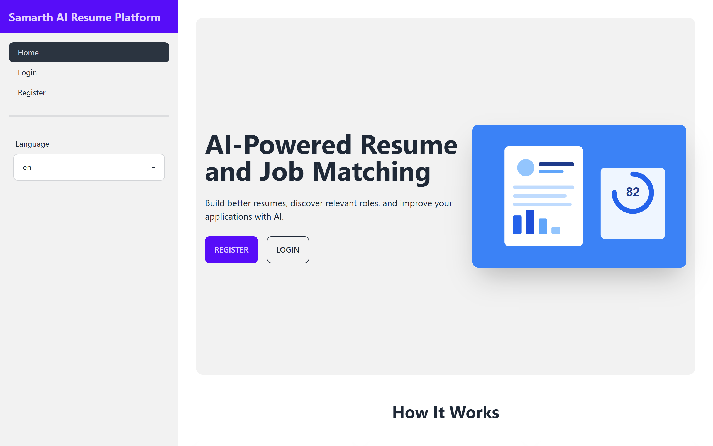
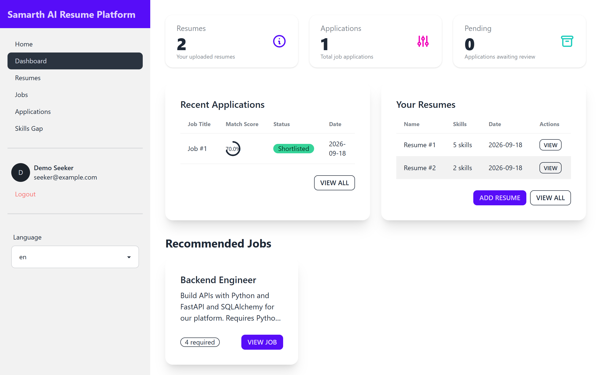
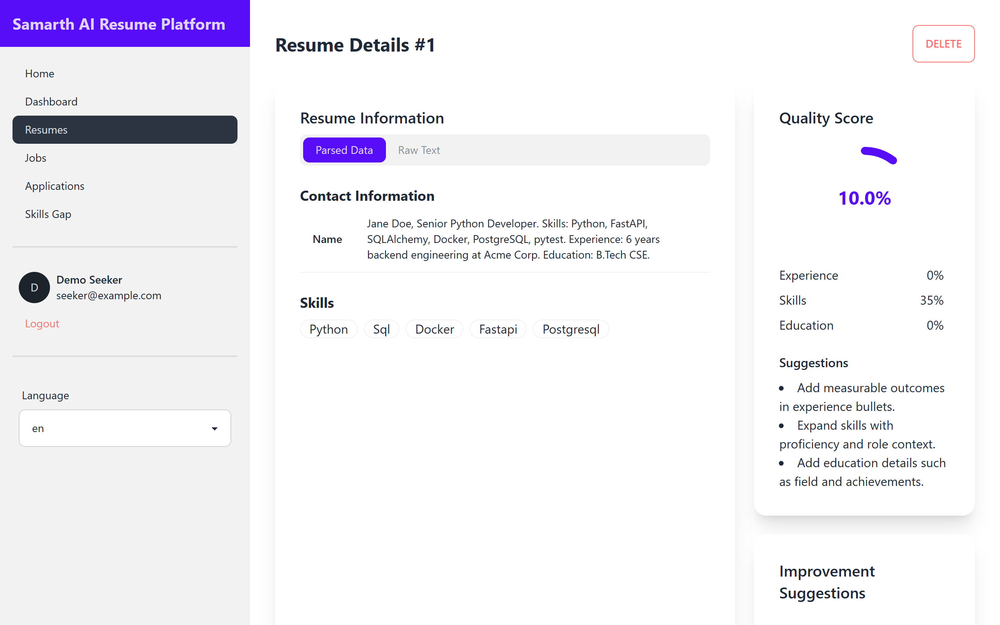
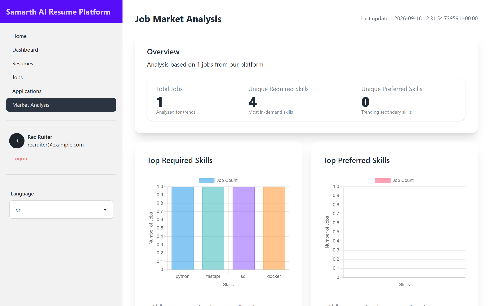
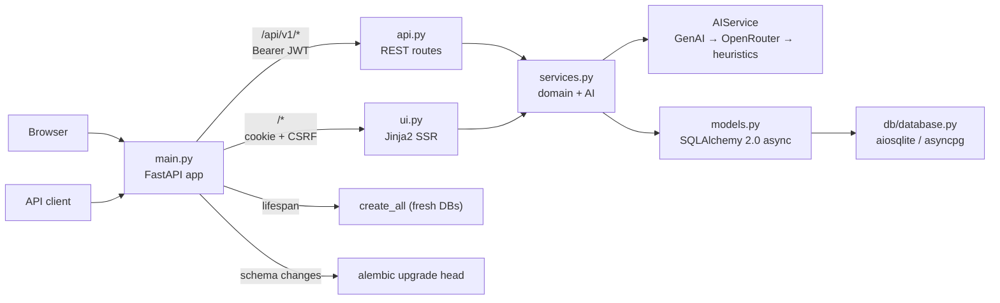

# Samarth AI

[](https://github.com/pranam-s/SamarthAI/actions/workflows/ci.yml)

A resume and job-matching platform for job seekers and recruiters. Upload a
resume, get it parsed into structured sections, match it against jobs with
scores and feedback, and run a skills-gap analysis that returns a learning
path. Recruiters post jobs, review applications with match details, and see
market-level skill demand.

FastAPI serves a REST API and a server-rendered UI from one codebase. Every
AI-dependent feature works without API keys: providers are tried in order
(Google GenAI, then OpenRouter), and a deterministic heuristic takes over when
neither is configured, so the app never blocks on an external service. The
screenshots below were captured from a keyless run, so what you see is the
heuristic mode real users get on a fresh clone.

| Landing | Dashboard (after login) |
|---|---|
|  |  |
| **Resume parse and quality score** | **Job market analysis (recruiter)** |
|  |  |

## Architecture

One FastAPI process, two surfaces, one service layer:



Routes carry no SQL and no AI calls. `services.py` holds the domain logic
and the provider chain; `models.py` holds four ORM tables (users, resumes,
jobs, applications); schema changes go through Alembic migrations, with
`create_all` kept as a fresh-database convenience (docs/adr/0001).

Auth is bcrypt password hashing, PyJWT access tokens with `jti` revocation
(logout works on both API and UI), httponly cookies plus timed CSRF tokens
on the UI, and Bearer auth on the API. Login is rate-limited per client IP
+ submitted username (429 + `Retry-After`).

The UI is server-rendered semantic HTML: keyboard-navigable throughout, a
skip-to-content link, visible focus, decorative SVGs hidden from assistive
tech, chart canvases with localized labels and adjacent data tables, and
every string through the i18n pipeline (20 locales: 10 Indian, 10 global).

## Quick start

Requires Python 3.12 and [uv](https://docs.astral.sh/uv/). Nothing below
needs API keys, network access to AI providers, or an account.

```bash
uv sync --all-groups
uv run alembic upgrade head        # optional; create_all covers fresh DBs
uv run uvicorn main:app --port 8000
```

Then open <http://localhost:8000>, register an account, and create a resume
(paste text or upload PDF/DOCX/TXT). The OpenAPI docs live at
<http://localhost:8000/api/v1/docs>.

Configuration is optional; copy `.env.example` to `.env` to set
`SECRET_KEY`, `GOOGLE_API_KEY`/`OPENROUTER_API_KEY`, `DATABASE_URL`
(PostgreSQL via `postgresql+asyncpg://...`), cookie flags, or the login
rate-limit window. With no keys, parsing and scoring come from the
heuristics: directionally correct, coarser than the LLM paths. docs/EVALUATION.md
records that limitation.

## Verify

These are the repo's quality gates; every one was run green on the current
revision (numbers in docs/STATUS.md and docs/EVALUATION.md).

```bash
uv run ruff format --check .   # formatting
uv run ruff check .            # linting
uv run ty check                # type checking
uv run pytest tests/           # full suite, zero warnings
uv run deptry .                # dependency/dead-import hygiene
uv run alembic upgrade head    # migration chain against a fresh database
```

CI (GitHub Actions) runs the same gates plus a coverage floor of 95% on
`core/`, `db/`, `models.py`, and `schemas.py` (currently 469/469 statements,
100%). Actions are disabled on the repository to keep spend at zero; the
workflow is kept runnable and was validated by executing every job's commands
locally. For why reported coverage on `api.py`/`services.py`/`ui.py` is a
lower bound, see docs/EVALUATION.md (coverage.py misses code resumed after
aiosqlite awaits).

## API overview

All endpoints live under `/api/v1` (Bearer auth; full contracts in
`/api/v1/docs`):

| Method | Endpoint | Description |
|---|---|---|
| POST | `/auth/register` | Register (email, password ≥ 8 chars) |
| POST | `/auth/login` | OAuth2 form login; rate-limited, 429 + `Retry-After` |
| GET | `/auth/me` | Current user |
| POST | `/auth/logout` | Revoke the presented token for its remaining life |
| POST | `/resumes` | Create resume: multipart `file` upload or `resume_data` text |
| GET | `/resumes/{id}/improve` | AI/heuristic improvement suggestions |
| GET | `/resumes/{id}/quality-score` | Section-wise quality score |
| POST | `/resumes/upload-base64` | Create resume from base64-encoded file |
| GET | `/recommendations/{resume_id}` | Scored job recommendations |
| POST | `/jobs` | Post job (recruiter) |
| GET/PUT/DELETE | `/jobs/{id}` | Manage job (recruiter) |
| POST | `/match` | Score a resume against a job |
| POST | `/applications` | Apply to a job |
| PATCH | `/applications/{id}/status?status_value=` | Update status: New/Reviewed/Shortlisted/Rejected |
| GET | `/market-analysis` | Skill demand aggregation |
| POST | `/skills-gap` | Gap score, missing skills, learning path |

## Project structure

```text
├── main.py              App bootstrap & lifespan
├── api.py               REST routes (/api/v1/*)
├── ui.py                Server-rendered UI routes
├── services.py          AI + domain service layer
├── models.py            SQLAlchemy ORM models
├── schemas.py           Pydantic request/response schemas
├── core/                config, security, ratelimit, revocation, i18n
├── db/                  async engine & session factory
├── migrations/          Alembic (env wired to settings + Base.metadata)
├── prompts/             AI prompt templates (.md, {placeholder} slots)
├── templates/           Jinja2 SSR templates
├── static/              Static assets
├── tests/               pytest suite (API, UI, services, security, i18n, …)
├── docs/                design.md, BUILD_LOG, AUDIT, EVALUATION, STATUS, ADRs
├── Dockerfile           python:3.12-slim, non-root, healthcheck
└── docker-compose.yml   named volumes + resource limits
```

## Docker

```bash
docker compose up --build
```

Non-root container, health check on `/`, named volumes for uploads and the
database, 512 MB / 1 CPU limits.

## Honest limits

- Coverage percentages for `api.py`/`services.py`/`ui.py` are deterministic
  lower bounds: coverage.py misses code resumed after aiosqlite awaits
  (docs/EVALUATION.md). Those paths are tested behaviorally; the gated
  modules measure 100%.
- Heuristic parsing matches a fixed 26-skill vocabulary; resumes outside it
  parse coarsely without AI keys.
- Rate limiting and token revocation state are in-memory: per worker under
  multi-worker deployments, reset on restart. A shared store (Redis) is the
  recorded upgrade path.
- Recommendation scoring is sequential over up to 100 jobs; with real keys
  that is the dominant latency path (batching needs a product call,
  AUDIT A-13).

## Docs

| Document | Contents |
|---|---|
| docs/design.md | HLD + LLD, data flows, auth design, decision index |
| docs/BUILD_LOG.md | Engineering history: what was tried, rejected, kept |
| docs/AUDIT.md | Line-by-line audit findings and dispositions (A-01..A-29) |
| docs/EVALUATION.md | Measured gates, coverage matrix, limitations |
| docs/STATUS.md | Current state with real numbers from the last run |
| docs/adr/ | Architecture decision records |
| docs/style-guides/ | Python, FastAPI, and testing conventions |

## Contributing

See CONTRIBUTING.md. Accessibility and the no-suppression rule are the two
lines that do not move.

## License

MIT.
