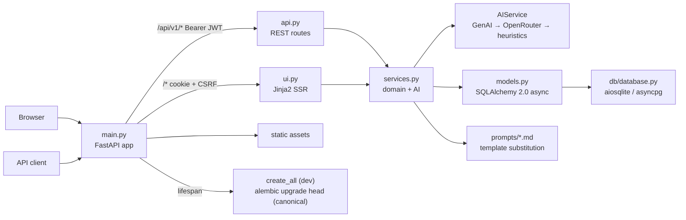

# Design — Samarth AI

High-level and low-level design for the platform. For a guided tour see the
README; for the running record of what changed and why, see BUILD_LOG.md;
point-in-time audit findings live in AUDIT.md and the current state in
STATUS.md.

## 1. Product shape (HLD)

Samarth AI is a server-rendered web platform for resume management and
AI-assisted job matching. Two audiences share one deployment:

- **Job seekers** upload or paste a resume, get it parsed into structured
  sections, browse jobs, apply, and run a skills-gap analysis against a
  specific job.
- **Recruiters** post and edit jobs, review applications with AI match
  details, update application status, and view market-level skill demand.

One FastAPI process serves both a REST API (for programmatic clients) and a
Jinja2 server-rendered UI (for browsers). The same domain services power
both, so a feature added once is available on both surfaces.

### Guided principles

1. **Keyless operation.** Every AI-dependent flow has a deterministic
   heuristic fallback, so the app is fully functional with no API keys.
   Providers are tried in order: Google GenAI (Gemini 2.5 Flash), OpenRouter
   (OpenAI-compatible), heuristics.
2. **One codebase, two surfaces.** `api.py` and `ui.py` are thin route
   layers; business rules live in `services.py`. No SQL or AI calls in
   routes (enforced by review and by the module table below).
3. **Honest degradation.** When an AI provider fails or is unconfigured, the
   fallback path is used and the user still gets a result. Nothing pretends
   to be AI output when it is not (scores are labeled with their source).
4. **Accessibility by construction.** The UI is semantic HTML with keyboard
   navigation, visible focus, a skip link, and all strings through the i18n
   pipeline (20 locales).

### System diagram

### Data flow: resume ingestion (the primary flow)

1. Upload arrives (multipart file, base64 payload, or pasted text).
2. Route layer validates the extension allow-list (`.pdf`/`.docx`/`.txt`)
   and hands the stream to `ResumeService.process_resume_file`, which caps
   size at `MAX_UPLOAD_SIZE` while writing to `UPLOAD_DIR` (413 on excess,
   415 on disallowed type).
3. Text extraction: PDF tries Gemini vision first, falls back to local
   `pypdf`; DOCX via `python-docx`; TXT used raw.
4. `AIService.parse_resume` builds the prompt from `prompts/parse_resume.md`,
   calls the provider chain, and extracts JSON with the bracket-tracking
   `parse_json`. With no provider, `_default_resume_payload` produces the
   heuristic extraction (fixed skill vocabulary).
5. Parsed sections land in the `resumes` row as JSON columns; the file path
   and type are recorded alongside.

### Data flow: matching and gap analysis

- `MatchingService.match_resume_to_job` = score + feedback. Score comes from
  the LLM (JSON with sub-scores) or the heuristic set-intersection model
  (weights 0.6 skills / 0.3 experience / 0.1 education). Feedback likewise
  (LLM or heuristic strengths/improvements). No score caching: each
  apply/recompute runs the scorer again.
- `analyze_skills_gap` is deterministic set arithmetic (matched, missing,
  importance-weighted gap score, learning path); an optional LLM pass may
  enrich the wording.

## 2. Module breakdown (LLD)

| Module | Responsibility | Must not contain |
|---|---|---|
| `main.py` | App factory, CORS (from settings), static mount, lifespan DDL | Business logic |
| `api.py` | REST routes under `/api/v1`, `get_current_user`, response shaping | SQL, AI calls, templates |
| `ui.py` | SSR routes, form handling, CSRF validation, locale cookie, redirects | SQL, AI calls, raw HTML |
| `services.py` | `AIService`, `ResumeService`, `JobService`, `MatchingService`, `UserService` | HTTP request/response handling |
| `schemas.py` | All Pydantic request/response contracts (import-light by design, A-25) | ORM access |
| `models.py` | 4 ORM tables: `users`, `resumes`, `jobs`, `applications` | Pydantic |
| `core/config.py` | `Settings` via pydantic-settings; `.env` loading; env access is centralized here | Any direct `os.environ` elsewhere |
| `core/security.py` | bcrypt hashing, PyJWT HS256 encode/decode (`sub` str, `jti`), CSRF serializer, `decode_token_subject` shared by API and UI | HTTP concerns |
| `core/ratelimit.py` | Login rate limiter: sliding window per IP + submitted username, injectable clock, periodic sweep | Policy for other endpoints |
| `core/revocation.py` | JWT `jti` denylist with expiry parity (entries dropped at token `exp`) | Persistence (in-memory by design) |
| `core/i18n.py` | 20-locale translations, `normalize_locale`, `translate` (EN fallback), locale list as single source of truth (A-11) | — |
| `db/database.py` | Async engine + session factory from `settings.DATABASE_URL` | Model definitions |
| `migrations/` | Alembic migration scripts; `env.py` wired to `models.Base.metadata` + settings URL | Ad-hoc schema edits outside revisions |
| `prompts/*.md` | Externalized AI prompt templates with `{placeholder}` slots | Python code |

## 3. Data model

Four tables, SQLAlchemy 2.0 typed mappings (see `models.py` for the full
column list):

- **users** — email (unique), `hashed_password` (bcrypt), profile fields,
  `is_recruiter`, `is_active`, timestamps.
- **resumes** — FK `users.id`; `full_text` plus JSON columns for parsed
  sections (skills, experience, education, projects, certifications,
  achievements); `file_path`/`file_type` for uploads; timestamps.
- **jobs** — FK `users.id` (recruiter); title, description, requirements;
  `required_skills` JSON; location, salary; timestamps.
- **applications** — FK `resumes.id` + `jobs.id`; status
  (new → reviewed → shortlisted → rejected); `match_score` JSON detail;
  timestamps.

Relationships use `lazy="selectin"` so a loaded user brings its resumes and
jobs in one extra query. Application listing renders from plain dict rows
built with two batch queries (A-15), not ad-hoc ORM attributes.

## 4. Auth design

- **Passwords.** bcrypt direct (no passlib), per-user salt, 72-byte input
  truncation handled per bcrypt 4+/5 semantics. Minimum length 8 enforced in
  `schemas.UserCreate` (API 422) and the UI register form (400) —
  `MIN_PASSWORD_LENGTH` lives in schemas.py to keep that module import-light
  (A-25).
- **Tokens.** PyJWT HS256; `sub` is the stringified user id (parsed to int
  at the boundary, A-04); `jti` enables revocation; expiry from settings
  (default 5 days).
- **Revocation.** `core/revocation.py` holds an in-memory `jti` denylist.
  Entries are dropped at the token's own `exp` (expiry parity). Logout (API
  + UI) revokes the presented token. The denylist is per worker and resets
  on restart — documented limitation with the Redis upgrade path recorded.
- **Cookies vs Bearer.** The UI uses httponly cookies with
  `COOKIE_SECURE`/`COOKIE_SAMESITE` from settings and a per-user timed CSRF
  token (itsdangerous, 2 h max age) validated on every authenticated form
  POST. The API uses `Authorization: Bearer`. Both paths share
  `decode_token_subject`, so revocation hits both at once (A-16).
- **Error semantics.** 401 + `WWW-Authenticate: Bearer` for missing/invalid
  credentials, 403 for authenticated-but-forbidden (inactive user), 409 for
  duplicate registration, 404 for unknown user (A-08).
- **Rate limiting.** `POST /api/v1/auth/login` only: sliding window per
  client IP + submitted username (default 5 attempts / 300 s,
  `LOGIN_RATE_LIMIT_*`), 429 + `Retry-After`. Blocked attempts are not
  recorded, so hammering cannot extend a lockout. Registration is not
  rate-limited (recorded decision, A-26).

## 5. AI provider chain

`AIService.call_text()` tries providers in order and returns the first
success; `parse_json()` extracts JSON from LLM prose with a bracket-tracking
scanner (handles fenced blocks and leading text). Prompts are Markdown files
in `prompts/` with `{placeholder}` substitution — prompt edits never touch
Python. Provider selection, key handling, and the heuristic fallbacks are
exercised in tests by disabling provider clients, never by monkeypatching
private members (see docs/style-guides/testing.md).

## 6. Database lifecycle and migrations

- **Canonical schema path:** Alembic (`migrations/`), baseline revision
  generated from `models.Base.metadata`; fresh databases run
  `alembic upgrade head`. See ADR-0001 for the adoption decision and the
  startup policy.
- **Dev convenience:** the lifespan still runs `create_all`, which is a
  no-op on an up-to-date database and keeps keyless first-run working. It is
  not the migration path; schema changes land as Alembic revisions.
- **Engines.** SQLite via aiosqlite (default, single-writer) or PostgreSQL
  via asyncpg; the URL comes from `settings.DATABASE_URL` and is passed to
  Alembic through `env.py` reading the same settings object — no secrets in
  the migration scripts.

## 7. Key decisions (index)

| Decision | Record | Status |
|---|---|---|
| Alembic adoption + startup policy (create_all kept as dev convenience) | ADR-0001 | Accepted 2026-09-18 |
| Login rate limiting scope (login only; registration excluded; in-memory) | AUDIT A-26 | Accepted 2026-09-14 |
| JWT revocation via jti denylist; restart-clears caveat documented | AUDIT A-26/A-27 | Accepted 2026-09-14 |
| Coverage gate scoped to fully-measurable modules (A-21 undercount) | AUDIT A-21, EVALUATION.md | Accepted 2026-09-14 |
| Sequential recommendation scoring kept until product input (batching changes cost/latency) | AUDIT A-13 | Open, deliberate |
| bcrypt direct (no passlib); PyJWT (not python-jose); itsdangerous CSRF | AUDIT A-22 | Accepted 2026-09-09 |

## 8. Failure modes and handling

- **Both AI providers down/unconfigured:** heuristic paths produce parses,
  scores, and feedback; flows never 500 because of AI.
- **Upload abuse:** extension allow-list + streaming size cap → 413/415;
  file deletion is async and tolerant of a vanished file (A-17).
- **Open redirect:** `/set-locale` accepts only same-origin relative
  redirect targets (A-03).
- **Exception leakage:** UI handlers log the detail server-side and render a
  generic localized error (A-05).
- **DB:** aiosqlite single-writer is adequate for single-node self-hosting;
  PostgreSQL is the switch for concurrent writes (URL change only).
